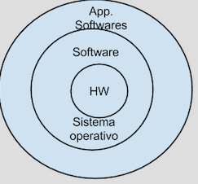
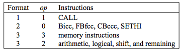
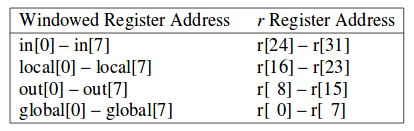
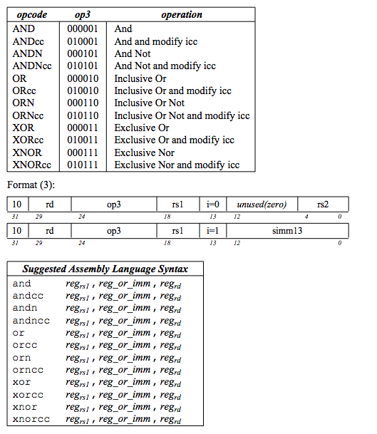
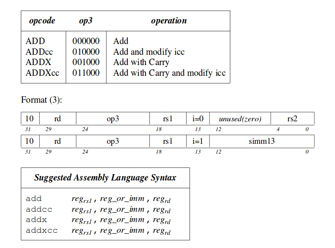
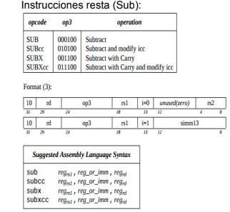
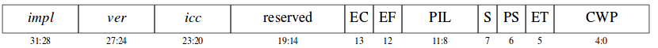

# ARQUITECTURA DE COMPUTADORES 2018
## TALLER ( PRIMER PARCIAL) 
### Christian Herrera 
1. ¿Qué es una arquitectura de computadores?

`Es el diseño, estructura, y agrupación de componentes físicos y lógicos para leer, escribir y procesar datos`

2. Nombre las generaciones de los computadores y sus características más relevantes
```
                            	Primera Generación - La válvula o tubo de vacío (1946-1954)
			    
1943 -> ENIAC -> 30 toneladas -> 140 Kw.
1946 -> Máquina de John Von Neumann (Arquitectura utilizada hasta nuestros días)
1953 -> IBM crea algunas máquinas (701, 704, 709).


			    	Segunda Generación - El Transistor (1957-1964)

1948 -> En los Laboratorios Bell inventaron el transistor y con este desarrollo se ganaron el premio Nobel
	de física.
1961 -> La empresa Digital Equipment Corporation (DEC) lanza un computador conocido como el PDP-1 con una 
	RAM de 120 KB, basado en transistores y la venta al público era de USD $120.000. En este mismo 
	año IBM lanza el IBM 7090 y tenía 32 KB de RAM
1964 -> Sale al mercado el CDC 1600 -> Primera Máquina paralela.

			    	
				
				Tercera Generación - El Circuito Integrado (1964-1971)
			    
1964 -> Aparece el S/360 -> Registros de 32 bits con direccionamiento de memoria de 2^24 posiciones.
1959 -> Texas Instruments desarrolla el primer circuito integrado con 12 transistores.

				
				
				Cuarta Generación - Large Scale Integration (LSI)
				Very Large Scale Integration (VLSI), Microprocesador (1971-1983)
				
Decenas de miles de transistores en un chip (LSI -> Large Scale Integration)
Cientos de miles de transistores en un chip (VLS -> Very Large Scale Integration)
Microprocesador.
Caída de precios por lo que la IBM desarrolla el primer PC.

				
				
				Quinta Generación - Very High Scale Integration (VHLSI), PC's (1990-????)

Very High Large Scale Integration -> millones de transistores.
```

3. Segun Flynn ¿ Cuál es la clasificación de las arquitecturas?
```Este tipo de clasificación también es conocida como la taxonomía de Flynn y se clasifica en 4 tipos:

SISD -  Single Instruction Single Data. Este tipo de arquitecturas normalmente se ven en celulares de 
 	gama baja, generalmente presente en sistemas con un sólo núcleo. 
	Se asigna la ejecución de una sola instrucción sobre un solo dato.

SIMD -  Single Instruction Multiple Data. En este caso una sola instrucción es ejecutada sobre un 
	conjunto de datos. Este tipo de arquitecturas tiene como ejemplo a los procesadores vectoriales.

MIMD -  Multiple Instruction Multiple Data - Aquí lo que se tiene es que un conjunto de instrucciones 
	diferentes se aplica sobre un conjunto de datos distintos. Un ejemplo de este tipo de 
	arquitecturas puede verse en las GPU, o incluso en sistemas conectados en clúster.

MISD -  Multiple Instruction Single Data. No es una arquitectura típica
```

4. Nombre las clases de aplicaciones de cómputo.
```
> Equipos de escritorio (PC’s)

> Equipos servidores. (Utilizados para almacenar bases de datos y a los cuales acceden 
	  muchos usuarios)
	  
> Tablets - dispositivos móviles

> Wearables

> Supercomputadores - HPC (High Performance Computing) - GPU : CPU (Sistemas heterogeneos)
```

5. Muestre la clasificación de la jerarquía de un equipo de cómputo.

      

6. ¿Qué es un compilador?

``` 
Es un software que verifica si "un programa de alto nivel" está bien escrito y si este es el caso,
traduce ese programa a lenguaje ensamblador
```
7. ¿ Defina qué es una instrucción?

`Son las operaciones que puede realizar el procesador`


8. ¿Cuales son los principios básicos de diseño de hardware de una arquitectura de cómputo, escriba una definición de cada uno?

```
* La simplicidad favorece la regularidad:

	>>>> Hacer diseños simples para garantizar que el procesador funcione bien siempre

* Pequeño es más rápido:

	>>>> Hacer nuestros programas con la menor cantidad de recursos posibles para 
	     que se ejecuten más rápido

* Hacer el caso común más rápido:

	>>>> Al realizar un diseño favorecer el caso frecuente sobre el infrecuente

*Buenos diseños implican grandes compromisos
```


9. ¿Qué es SPARCV8?

```
Es un arquitectura de computadores de 32 bits creada por Sun MicroSystems en 1985 
diseñada principalmente para optimizar compiladores
```

10. ¿Cuáles son las categorías de instrucciones de la arquitectura SPARCV8?



```
> Load/Store (carga / almacenamiento)

> Aritmético-lógicas

> CTI(Control Transfer Instruction - Instrucciones de control de tranferencia )

> Acceso a registros de estado

> Instrucciones de unidad de punto flotante

>Intrucciones de co-procesador
```

11. ¿Que tipos de registros se encuentran en SPARC V8?



```
> Registros de Entrada:   8 registros de propósito general. Por estándar se sugiere que sean 
			  usados para recibir parámetros.

> Registros de Salida:    8 registros de propósito general. Por estándar se sugiere que sean 
                          usados para retornar valores.
			  
> Registros Locales:      8 registros de propósito general. Por estándar se sugiere que sean 
			  usados para definir variables dentro de una función.
			  
> Registros Globales: 	  8 registros de propósito general. Por estándar se sugiere que sean
			  usados para almacenar variables globales
```

12. ¿ Cuál es el número mínimo y máximo de registros que se puede implementar en la arquitectura SPARCV8?

`mínimo 32 y máximo 520`

13. ¿ Cuáles son las instrucciones de acceso a memoria de SPARCV8? de un ejemplo de cada uno.

`LOAD : Carga un dato de memoria en un registro`
```assembly

Load [%L0 + (30*4)], %L1  	  //Cargo en el registro L1 el valor de la posición 30 del 
				  //vector cuya dirección de memoria se encuentra en L0
```
`STORE: Escribe un dato en memoria`
```assembly	
St %L1, [%O0 + (300*4)]           //Almaceno el valor que contiene L1 en la posición 300 del
				 //vector cuya dirección de memoria se encuentra en O0
```

14. Represente los siguientes números en complemento a 2.
```c
a.5

en 32 bits  --> 0000000000000000000000000000101
lo invierto --> 1111111111111111111111111111010
sumo 1	    -->				      1
-----------------------------------------------
-5          --> 1111111111111111111111111111011

b.12890

en 32 bits  --> 0000000000000000011001001011010
lo invierto --> 1111111111111111100110110100101
sumo 1	    -->				      1
-----------------------------------------------
-12890      --> 1111111111111111100110110100110

c.56900
en 32 bits  --> 0000000000000001101111001000100
lo invierto --> 1111111111111110010000110111011
sumo 1	    -->				      1
-----------------------------------------------
-12890      --> 1111111111111110010000110111100

d.11
en 32 bits  --> 0000000000000000000000000001011
lo invierto --> 1111111111111111111111111110100
sumo 1	    -->				      1
-----------------------------------------------
-11         --> 1111111111111111111111111110101

e.140
en 32 bits  --> 0000000000000000000000010001100
lo invierto --> 1111111111111111111111101110011
sumo 1	    -->				      1
-----------------------------------------------
-11         --> 1111111111111111111111101110100
```
15. Explique las instrucciones aritmético lógicas y su sintaxis en lenguaje ensamblador.







16. Explique cada uno de los campos de los 3 formatos de la arquitectura SPARC V8.

```
> rd:	     Es el registro fuente o el registro destino para una instrucciones load/store 
             ó alguna operación aritmético-lógica.
       
       
> a:         Es un bit de anulación que evita que un salto sea tomado.

> cond:      Codifican la condición que se evalúa para determinar si un salto se hace o no.

> imm22:     Son los 22 bits que usa la instrucción SETHI para llevarlos a los 22 bits más
             significativos de un registro destino.

> disp22 y  
  disp30:    Valores de desplazamiento relativo dentro de la memoria de instrucciones
 	     utilizados por BRANCH y por las instrucción CALL.


>op3:       Es un campo de 6 bits que ayuda a codificar todas las instrucciones de formato 3.

>i:         Es un bit que ayuda a determinar si el segundo operando de una instrucción 
            arimética-lógica, es un valor inmediato o el contenido de un registro.
	   
>asi:       Estos 8 bits ayudan a codificar un identificador de espacio de 
            direccionamiento (Address Space Identifier)
	   
>rs1:       El primer opernando de una instruccion aritmético-lógica, Load/Store, o de corrimiento.

>rs2:       Segundo operando de una instruccion si i = 1.

>imm13:     Segundo operando de una instruccion si i = 0.

>opf:       Codificación de operaciones de punto flotante.
```
17. ¿Qué diferencia hay entre el campo **op, op2 y op3**?

```
El op indica qué tipo de instrucción se va a realizar
El op2 es una subclasificación de instrucciones y solo se usa cuando el op es 2 (formato2)
El op3 es una subclasificación de instrucciones y solo se usa cuando el op es 3 (formato3)
```
18. ¿Qué es **PSR** ?, explique cada uno de sus campos.

```
Es el registro de estado de procesador con el cual controlo información importante 
sobre el estado de las operaciones.
Tiene 32 bits y se divide de la siguiente manera:
```


```
> impl: 	Implementación

> version: 	Vérsión

>ICC: 		Esta dividido en 4 bits: n: Negativo cuando una operación da 
		un número negativo, Z: se coloca en 1, cuando el resultado de
		la operación da cero, v: Over Flow se activa cuando el resultado de una operación 
		da más de 32 bits y el bit c: Carry, se activa cuando se tiene acarreo.
		
> reserved: 	Son un conjunto de bit no definidos dentro de la especificación de 
		la arquitectura para que el diseñador los use de manera libre.

> EC:		(Enable co-processor) Indica si el procesador tiene unidad de 
		co-procesamiento(FPGA,Targeta gráfica, etc)

> EF: 		Es un bit que me indica si la arquitectura tiene unidad de punto flotante.

> PIL: 		Processor Interrupt level(la arquitectura SPARC V8 tiene iterrupciones llamadas Traps)

> S: 		Supervisor; Indica el modo en el cual se ejecutó el procesador durante 
		la instruccion anterior.

> ET: 		Habilita al procesador para que soporte traps.

> CWP: 		(Current Windows Pointer)Indica sobre que ventana estoy accediendo o guardando los datos.
```

19. ¿ Qué es **ICC** y **CWP**?

`Está definido en el punto 18`

20. ¿Qué es una instrucción sintética, de dos ejemplos?

```
Son instrucciones similares a las de la máquina pero que no existen en realidad.
Es el compilador el que traduce cada instrucción sintética por otra equivalente a 
partir del conjunto de instrucciones máquina. 
Estas instrucciones existen para facilitar la programación y legibilidad de los programas.

Ejemplos:
```
```assembly
MOV 5, %L0     	//Por debajo está ejecutando una instrucción OR 5, %G0, %L0
CMP %L1 , %L2   //Por debajo está ejecutando SUBicc %L1, %L2
```
21. ¿Qué significa el campo **a** para una instrucción BRANCH?.
`Es un flag para definir si quiero ejecutar Delay SLOT (La instrucción siguiente) antes de hacer un salto`

22. ¿Para qué la instrucción **CALL** utiliza el registro %O7?.
```
Porque ese registro almacena el PC desde donde se invocó el CALL, y necesito esa dirección de memoria como
referencia para saber donde debo continuar una vez termina de ejecutar la función invocada
```
23. Convertir el siguiente programa en lenguaje de máquina a lenguaje ensamblador y luego a lenguaje de alto nivel:
```assembly
10100000000100000010000000000101         OR  5, %G0, %L0
10100010000100000011111111111010         OR -6, %G0, %L1
10010000000001000100000000010000        ADD %L1, %L0, %00
```
```c
int main(){
 int a = 5;
 int b = -6;
 
 return a + b;
}
```

24.Solucione el siguiente programas en lenguaje ensamblador, lenguaje de máquina y hexadecimal, además coloque su dirección de memoria.
```c
int main(){
	int i = 5; 
	int b = -4;
	int c[100];
	int d[20];
	c[5] = i + 2;
	d[4] = b + 3;
	return c[5] + d[4] -i
}
```
```assembly
      ENSAMBLADOR				   MÁQUINA				  HEXA

//inializacion de variables
0000  MOV  5, %L0                       10100000000100000010000000000101                0XA0102005
0004  MOV -4, %L1                       10100010000100000011111111111100                0XA2103FFC

//sumas y escritura en vectores
0008  ADD %L0,2, %L0                    10100000000001000010000000000010                0XA0042002
000C  ST %L0, [%L2 +(5*4)]              11100100001001000010000000010100                0XE4242014
0010  ADD %L1, 3, %L1                   10100010000001000110000000000110                0XA2043006
0014  ST %L1, [%L3 + (4*4)]             11100110001001000110000000010000                0XE6246010

//return
0018  LOAD [%L2 +(5*4)], %L4            11101000000001001010000000010100                0XE804A014   
001C  LOAD [%L3 + (4*4)], %L5           11101010000001001110000000010000                0XEA04E010
0020  ADD %L4, %L5, %L4                 10101000000001010000000000010101                0XA8050015       
0024  SUB %L4, %L0, %O0                 10010000001001010000000000010000                0X90250010
```

25. Convierta el siguiente código a lenguaje ensamblador, máquina **SPARC V8** y hexadecimal.

a.
 ```c
 int main(){
 int a = 8;
 int b = -14800;
 int c = 33; 
 if((a+b)<=b*16){
 	c=a+(b*2);
	}
else{
	return b-78;
}
	return a+c;
}
 ```
```assembly
      ENSAMBLADOR				   MÁQUINA				  HEXA

//inicializo variables
0000  MOV 8, %L0                         10100000000100000010000000001000               0XA0102008          
0004  SETHI 4195289, %L1                 00100011001111111111111111110001               0X233FFFF1
0008  OR %L1, 560 , %L1                  10100010000101000110001000110000               0XA2146230
000C  MOV 33, %L2                        10100100000100000010000000100001               0XA4102021          

//Calculo la condicion del if
0010  ADD %L0, %L1, %L3                  10100110000001000000000000010001               0XA6040011
0014  SLL %L1, 4, %L4                    10101001001011000110000000000100               0XA92C6004              
0018  CMP %L3, %L4                       10000000101001001100000000010100               0X80A4C014        
001C  BG a, @else                        00110100100000000000000000101100               0X3480002C               

//Cuando se cumple if
0020  SLL %L1, 1, %L5                    10101011001011000110000000000001               0XAB2C6001
0024  ADD %L5, %L0, %L2                  10100100000001010100000000010000               0XA4054010
0028  BA, a, @finDesdeIF		 00110000100000000000000000110100               0X30800034

@else
002C sub %L1 , 78 , %O0			 10010000000001000110000001001110               0X9004604E
0030 ba , a , @finDesdeElse              00110000100000000000000000111000		0X30800038               

@finDesdeIF
0034 add %L0 , %L2 , %O0		 10010000000001000000000000010010               0X90040012

@finDesdeElse
0038 Nop                                 00000001000000000000000000000000               0X1000000
``` 

b.
 ```c
int main(){
	int a = 8;
	int b = -10;
	if(a!=b){
		return c/16;
	}
	else{
		return b*32;
	}
}
```
 ```assembly
      ENSAMBLADOR				   MÁQUINA				  HEXA 
0000 MOV 8, %L0                        101000000001000000100000000001000               0X140204008
               

0004 MOV -10, %L1
0008 CMP %L0, %L1
000C BE, A, @else
0010 SRL, %L2,4 %O0
0014 BA, A, @fin
@else
0018 SLL %L1, 5, %O0
@fin
001C NOP
 
 
 
 ```


c.

 ```c
int main(){
	int a = -21180;
}
```

26. Convierta el siguiente código a lenguaje ensamblador, máquina **SPARC V8** y hexadecimal.
 ```c
int test(int x, int y, int w){
	int z;
	z = x - y + w*4;
	return z + 2;
}

int main(){
	int a = 4, b = 2, c = -15600;
	int x = test(a,b,c);
	return x + 45;
}
 ```

27. Implemente la función **Pot** en lenguaje de alto nivel,lenguaje ensamblador **SPARC V8** y lenguaje de máquina SPARC V8 que realice la potencia de dos números enteros sin signo realizando llamados a la función multiplicacion hecha en clase.

28. Implemente una función **Fact** en lenguaje de alto nivel, lenguaje ensamblador **SPARC V8** y lenguaje de máquina SPARC V8 que calcule el factorial de un número entero sin signo.
